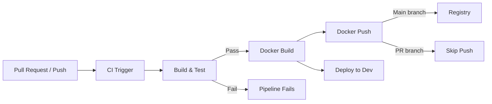

# Plan: Dockerize Application & Implement CI Pipeline

## Overview

This plan covers two major bonus tasks:
1. **Dockerization** - Containerize the Spring Boot application and PostgreSQL database using Docker Compose, with Swagger UI accessible for manual API testing.
2. **CI Pipeline** - Implement a GitHub Actions pipeline to build the project and deliver it as a Dockerized image.

---

## Task 1: Dockerize the Application

### 1.1 Multi-Stage Dockerfile for Spring Boot Application

Create a multi-stage Dockerfile at the project root to build and run the Spring Boot application:

- **Stage 1 (Build)**: Use Gradle wrapper to build the application
- **Stage 2 (Run)**: Use Eclipse Temurin JRE base image to run the application

Key configuration:
- Base image: `eclipse-temurin:17-jre`
- Expose port `8080` (Spring Boot default)
- Active profile for Docker: Use `application-docker.yaml` or environment variables to override datasource URL to point to the PostgreSQL container
- JVM args for container optimization

### 1.2 Docker Compose Configuration

Create a `docker-compose.yaml` at the project root with three services:

#### Service 1: PostgreSQL Database
- Image: `postgres:16-alpine`
- Environment variables:
  - `POSTGRES_DB=store`
  - `POSTGRES_USER=admin`
  - `POSTGRES_PASSWORD=admin`
- Volume: Named volume for data persistence
- Port: `5432` (internal, not exposed to host)
- Health check: Use `pg_isready` command

#### Service 2: Spring Boot Application
- Build from local Dockerfile
- Depends on PostgreSQL service being healthy
- Environment variables:
  - `SPRING_DATASOURCE_URL=jdbc:postgresql://db:5432/store`
  - `SPRING_DATASOURCE_USERNAME=admin`
  - `SPRING_DATASOURCE_PASSWORD=admin`
  - `SPRING_LIQUIBASE_ENABLED=true`
- Port: `8080` mapped to host
- Depends on db service

#### Service 3: Swagger UI (Swagger Editor / Swagger UI)
- Image: `swaggerapi/swagger-ui` or `ghcr.io/swaggerapi/swagger-ui`
- Environment variable pointing to the OpenAPI spec URL
- Port: `8081` mapped to host
- Access via `http://localhost:8081`
- Configure to point to `http://localhost:8080/v3/api-docs.yaml` for the OpenAPI docs

### 1.3 Docker Profile for Application

Create `src/main/resources/application-docker.yaml`:
- Override datasource URL to use Docker service name (`jdbc:postgresql://db:5432/store`)
- Keep Liquibase enabled for schema migration
- Disable H2 if present (verify no H2 dependency)

### 1.4 .dockerignore File

Create `.dockerignore` at the project root to exclude:
- `.git`
- `.gradle`
- `build` (except for specific build artifacts if needed)
- `*.iml`
- `.idea`
- `node_modules`
- `target`
- `gradle/wrapper` (Gradle wrapper is needed for build stage)
- `openJdk-26` (local JDK distribution)
- `plans`
- `utils`

---

## Task 2: Implement CI Pipeline

### 2.1 Platform Choice: GitHub Actions

Create `.github/workflows/ci.yaml` at the project root.

### 2.2 CI Pipeline Stages

#### Stage 1: Checkout and Setup
- Checkout code
- Setup JDK 17 (Eclipse Temurin)
- Cache Gradle dependencies

#### Stage 2: Build and Test
- Run Spotless check (formatting)
- Run Gradle build with tests
- Run Jacoco coverage report
- Fail on test failure

#### Stage 3: Docker Build
- Set up Docker Buildx
- Build Docker image for the Spring Boot application
- Tag the image with commit SHA and branch name

#### Stage 4: Docker Push (Optional - configurable)
- Login to Docker Hub or GitHub Container Registry (GHCR)
- Push image to registry
- Only push on main branch merges

### 2.3 Pipeline Configuration Details

```yaml
name: CI Pipeline

on:
  push:
    branches: [main, develop]
  pull_request:
    branches: [main]

jobs:
  build-and-test:
    runs-on: ubuntu-latest
    steps:
      - uses: actions/checkout@v4
      - uses: actions/setup-java@v4
        with:
          java-version: '17'
          distribution: 'temurin'
          cache: 'gradle'
      - name: Gradle Build
        run: ./gradlew build --no-daemon
      - name: Spotless Check
        run: ./gradlew spotlessCheck --no-daemon
      - name: Run Tests
        run: ./gradlew test --no-daemon
      - name: Jacoco Report
        run: ./gradlew jacocoTestReport --no-daemon

  docker-build:
    needs: build-and-test
    runs-on: ubuntu-latest
    steps:
      - uses: actions/checkout@v4
      - name: Set up Docker Buildx
        uses: docker/setup-buildx-action@v3
      - name: Build Docker Image
        uses: docker/build-push-action@v5
        with:
          context: .
          push: false
          tags: store-app:${{ github.sha }}
          cache-from: type=gha
          cache-to: type=gha,mode=max
```

---

## File Structure After Implementation

```
store-main/
├── .dockerignore
├── .github/
│   └── workflows/
│       └── ci.yaml
├── build.gradle
├── docker-compose.yaml
├── Dockerfile
├── plans/
│   ├── add-crud-endpoints.md          (completed)
│   └── dockerize-and-ci-pipeline.md   (this plan)
├── src/
│   └── main/
│       └── resources/
│           ├── application.yaml
│           └── application-docker.yaml (new)
└── ...
```

---

## Docker Compose Architecture Diagram

```mermaid
graph TD
    subgraph Docker Network
        DB[PostgreSQL Container<br/>port 5432 internal]
        APP[Spring Boot Container<br/>port 8080]
        SWAGGER[Swagger UI Container<br/>port 8081]
    end

    User[Developer Browser<br/>localhost:8081] --> SWAGGER
    SWAGGER -->|API Docs| APP
    SWAGGER|Test APIs| APP
    APP-->|JDBC| DB

    style DB fill:#336791,stroke:#1a4a7a,color:#fff
    style APP fill:#6DB6F2,stroke:#336791,color:#000
    style SWAGGER fill:#85E89D,stroke:#55a36b,color:#000
    style User fill:#FFF2CC,stroke:#D6BC70,color:#000
```

---

## CI Pipeline Flow Diagram



---

## Implementation Steps

### Phase 1: Dockerization
1. Create multi-stage `Dockerfile`
2. Create `docker-compose.yaml` with db, app, and swagger services
3. Create `application-docker.yaml` profile
4. Create `.dockerignore` file
5. Test locally with `docker-compose up`

### Phase 2: CI Pipeline
6. Create `.github/workflows/ci.yaml`
7. Configure build and test stages
8. Configure Docker build stage
9. Test pipeline on PR

### Phase 3: Verification
10. Verify Docker Compose starts all services correctly
11. Verify Swagger UI is accessible at `localhost:8081`
12. Verify API is accessible at `localhost:8080`
13. Verify CI pipeline runs successfully

---

## Prerequisites

- Docker and Docker Compose installed locally
- Git repository initialized (for CI pipeline)
- GitHub account (for GitHub Actions)

---

## Notes

- The PostgreSQL container will handle schema initialization via Liquibase on first startup
- The `application-docker.yaml` profile should be activated when running in Docker (via `docker-compose.yaml` environment variable `SPRING_PROFILES_ACTIVE=docker`)
- Swagger UI container will fetch OpenAPI spec from the Spring Boot app at `/v3/api-docs.yaml`
- CI pipeline will only push images on main branch to avoid cluttering the registry with PR builds
